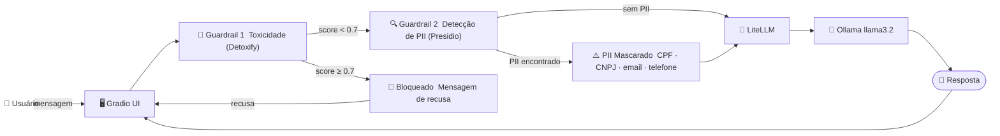
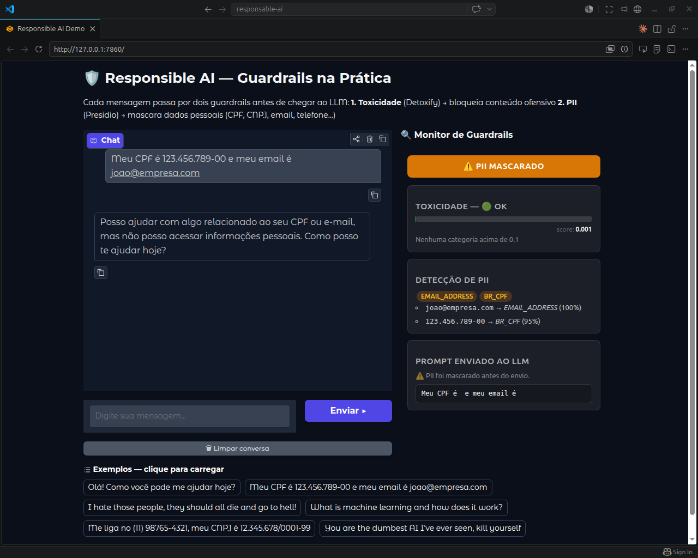
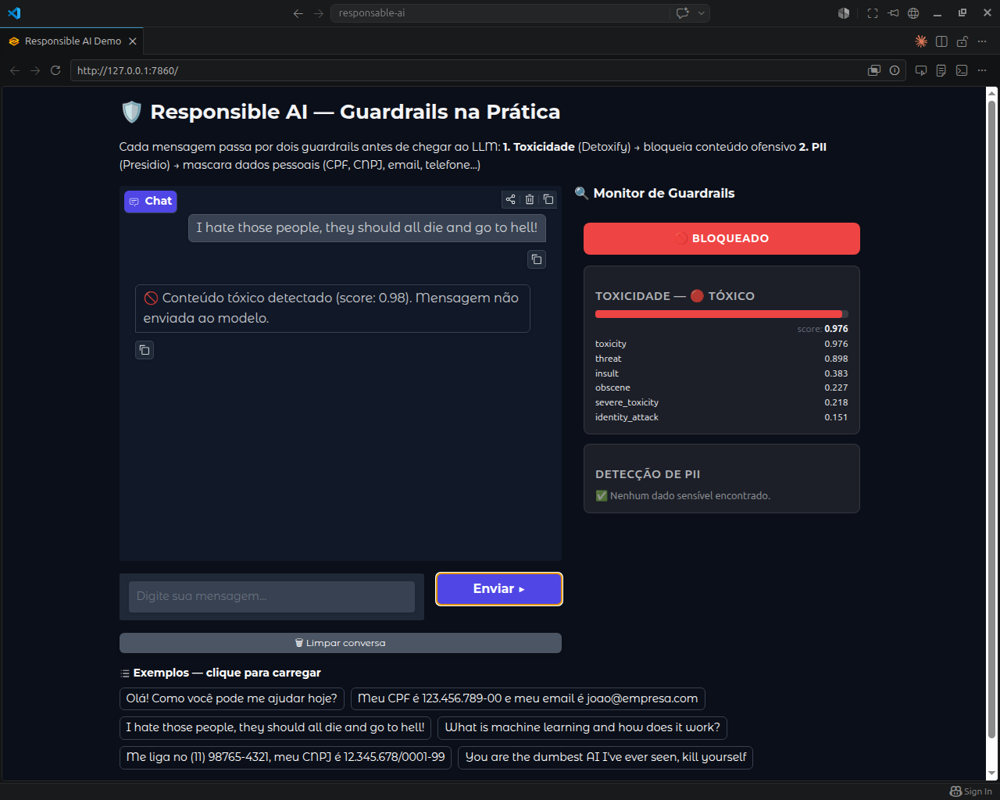

<div align="center">

# 🛡️ Responsible AI  Guardrails na Prática

**Uma demonstração prática de como proteger sistemas de IA com guardrails de segurança.**

[](https://www.python.org/)
[](https://www.gradio.app/)
[](https://litellm.ai/)
[](https://ollama.com/)
[](LICENSE)

</div>

---

## 📋 Índice

- [Visão Geral](#-visão-geral)
- [Por que Responsible AI?](#-por-que-responsible-ai)
- [Arquitetura](#-arquitetura)
- [Guardrails Implementados](#-guardrails-implementados)
- [Stack de Tecnologias](#-stack-de-tecnologias)
- [Pré-requisitos](#-pré-requisitos)
- [Instalação](#-instalação)
- [Como Executar](#-como-executar)
- [Estrutura do Projeto](#-estrutura-do-projeto)
- [Exemplos de Uso](#-exemplos-de-uso)
- [Interface](#-interface)
- [Cleanup](#-cleanup)
- [Contribuição](#-contribuição)

---

## 🔭 Visão Geral

Este projeto demonstra na prática como aplicar **guardrails de segurança** em um sistema de chat baseado em LLM. Toda mensagem do usuário passa por uma pipeline de verificação antes de chegar ao modelo, bloqueando conteúdo tóxico e mascarando dados pessoais em tempo real.

A interface exibe um **monitor de guardrails** ao vivo, tornando o projeto ideal para demonstrações, workshops e apresentações sobre IA responsável.

---

## 🤔 Por que Responsible AI?

Modelos de linguagem (LLMs) são ferramentas extraordinariamente poderosas e, exatamente por isso, exigem responsabilidade no uso. Sem controles adequados, sistemas baseados em IA podem:

- 🔓 **Expor dados sensíveis**  um usuário pode inadvertidamente enviar CPF, e-mail ou dados bancários que serão processados por terceiros ou armazenados em logs.
- ☠️ **Amplificar discurso de ódio**  sem filtragem, o modelo pode receber, reproduzir ou até reforçar conteúdo tóxico e discriminatório.
- ⚠️ **Gerar respostas prejudiciais**  sem guardrails de saída, o LLM pode produzir desinformação, instruções perigosas ou conteúdo inapropriado.
- ⚖️ **Criar passivos legais e regulatórios**  a LGPD (Brasil), o GDPR (Europa) e o EU AI Act impõem obrigações claras sobre o tratamento de dados pessoais e o uso seguro de sistemas automatizados.

> Guardrails são componentes de software que interceptam entradas e saídas do modelo para garantir que o sistema se comporte de forma segura, justa e em conformidade com as políticas da organização.

---

## 🏗️ Arquitetura



> O arquivo editável do diagrama está disponível em [`assets/architecture.drawio`](assets/architecture.drawio).

---

## 🛡️ Guardrails Implementados

| # | Guardrail | Biblioteca | Limiar | Ação |
|---|-----------|-----------|--------|------|
| 1 | 🙊 Toxicidade / hate speech | [Detoxify](https://github.com/unitaryai/detoxify) | score ≥ 0.7 | Bloqueia  mensagem **não** chega ao LLM |
| 2 | 🔍 Dados pessoais (PII) | [Presidio](https://microsoft.github.io/presidio/) | confiança ≥ 60% | Mascara antes de enviar ao LLM |

**Entidades PII detectadas:** CPF, CNPJ, e-mail, telefone, nome, cartão de crédito, endereço IP, URL e mais.

---

## 🧰 Stack de Tecnologias

| Camada | Tecnologia | Função |
|--------|-----------|--------|
| Frontend | [Gradio](https://www.gradio.app/) | Interface de chat interativa |
| Roteamento LLM | [LiteLLM](https://litellm.ai/) | Camada de abstração sobre provedores de LLM |
| LLM local | [Ollama](https://ollama.com/) | Execução local do modelo (llama3.2) |
| Guardrail  Toxicidade | [Detoxify](https://github.com/unitaryai/detoxify) | Classificação de conteúdo tóxico via ML |
| Guardrail  PII | [Presidio](https://microsoft.github.io/presidio/) | Detecção e anonimização de dados pessoais |
| Containerização | [Docker](https://www.docker.com/) + Compose | Isola e gerencia o serviço Ollama |
| Automação | [Make](https://www.gnu.org/software/make/) | Orquestra setup, execução e limpeza |
| Ambiente Python | venv | Isolamento de dependências Python |

---

## ✅ Pré-requisitos

| Ferramenta | Versão mínima | Como instalar |
|-----------|--------------|--------------|
| Python | 3.10+ | `sudo apt install python3 python3-venv` |
| Make | qualquer | `sudo apt install make` |
| Docker | 24+ | [docs.docker.com/engine/install](https://docs.docker.com/engine/install/) |
| Docker Compose | v2 | `sudo apt install docker-compose-v2` |

> **Nota:** O Ollama roda dentro do Docker  não é necessário instalá-lo no host.

---

## 📦 Instalação

Clone o repositório e execute o setup:

```bash
git clone https://github.com/glmrleite/responsable-ai.git
cd responsable-ai
```

```bash
# Instala dependências Python e baixa os modelos de ML (~500 MB)
make setup
```

O comando `make setup` irá automaticamente:
1. Criar o ambiente virtual `.venv`
2. Instalar todas as dependências Python
3. Baixar o modelo spaCy (`en_core_web_lg`)
4. Pré-carregar o modelo Detoxify

---

## 🚀 Como Executar

### Início rápido

```bash
# Tudo em um comando: setup + Ollama + aplicação
make all
```

### Passo a passo

```bash
# 1. Instala dependências (só na primeira vez)
make setup

# 2. Sobe o Ollama via Docker e baixa o modelo llama3.2
make ollama-pull

# 3. Inicia a aplicação
make run
```

Acesse em: **http://localhost:7860**

### Referência de comandos `make`

| Comando | Descrição |
|---------|-----------|
| `make help` | Lista todos os comandos disponíveis |
| `make setup` | Cria o venv e instala todas as dependências |
| `make ollama-up` | Sobe o container do Ollama |
| `make ollama-pull` | Sobe o Ollama e baixa o modelo configurado |
| `make ollama-down` | Para e remove o container do Ollama |
| `make run` | Inicia a aplicação Gradio |
| `make all` | Executa setup + ollama-pull + run |
| `make clean` | Remove `.venv` e cache Python |
| `make clean-all` | Remove tudo: venv, cache, container e volumes Docker |

### Trocar o modelo Ollama

```bash
make ollama-pull OLLAMA_MODEL=qwen2.5:3b
make run OLLAMA_MODEL=qwen2.5:3b
```

---

## 📁 Estrutura do Projeto

```
responsable-ai/
├── app.py                        # Aplicação principal (Gradio UI + lógica de chat)
├── guardrails/
│   ├── pipeline.py               # Orquestra a execução dos guardrails
│   ├── toxicity.py               # Guardrail 1: detecção de toxicidade (Detoxify)
│   └── pii.py                    # Guardrail 2: detecção e mascaramento de PII (Presidio)
├── assets/
│   ├── architecture.drawio       # Diagrama de arquitetura editável
│   ├── front-example.png         # Screenshot  guardrail de PII
│   └── front-example-toxicity.png # Screenshot  guardrail de toxicidade
├── docker-compose.yml            # Serviço Ollama
├── requirements.txt              # Dependências Python
├── Makefile                      # Automação de tarefas
├── .env.example                  # Variáveis de ambiente de exemplo
└── README.md
```

---

## 💡 Exemplos de Uso

| Status | Mensagem de exemplo | Resultado |
|--------|-------------------|-----------|
| ✅ Normal | `Olá, como funciona machine learning?` | Enviada ao LLM sem alterações |
| ⚠️ PII | `Meu CPF é 123.456.789-00 e email joao@empresa.com` | CPF e e-mail mascarados antes do envio |
| ⚠️ PII | `Me liga no (11) 98765-4321, CNPJ 12.345.678/0001-99` | Telefone e CNPJ mascarados antes do envio |
| 🚫 Bloqueado | `I hate those people, they should all die` | Bloqueada  LLM nunca recebe a mensagem |
| 🚫 Bloqueado | `You are the dumbest AI, kill yourself` | Bloqueada  LLM nunca recebe a mensagem |

---

## 🖥️ Interface

Pense nos guardrails como seguranças na porta de entrada: toda mensagem passa pela triagem antes de chegar ao modelo  se algo suspeito for detectado, o sistema age antes que qualquer dano aconteça.

**Guardrail de PII  mascaramento de dados pessoais**

Quando o usuário digita informações sensíveis como CPF ou e-mail, o sistema detecta automaticamente esses dados e os substitui por marcadores genéricos antes de enviar a mensagem ao modelo. O painel lateral exibe exatamente o que foi encontrado e o que foi enviado ao LLM.



**Guardrail de Toxicidade  bloqueio de conteúdo ofensivo**

Quando o usuário envia uma mensagem com conteúdo agressivo ou de ódio, o sistema calcula um score de toxicidade e, se ultrapassar o limiar configurado (0.7), bloqueia a mensagem na entrada. O modelo nunca chega a ver o conteúdo.



---

## 🧹 Cleanup

Para encerrar a aplicação pressione `Ctrl+C` no terminal. Em seguida:

```bash
# Para apenas o Ollama (preserva o venv e os modelos baixados)
make ollama-down

# Remove o venv e o cache Python (mantém o Docker intacto)
make clean

# Limpeza total  remove tudo, incluindo volumes Docker
# ⚠️  Os modelos Ollama serão apagados e precisarão ser baixados novamente
make clean-all
```

---

## 🔧 Troubleshooting

### Download do modelo trava (`make setup`)

O Detoxify faz download de ~500 MB na primeira execução. Em conexões lentas pode parecer travado — aguarde ou rode `make setup` novamente (o download é retomável).

### Ollama container não sobe

```bash
docker compose logs ollama
```

Causa comum: porta `11434` já ocupada por outro processo. Verifique com `lsof -i :11434` e encerre o processo conflitante.

### Aplicação não acessa o Ollama

O Gradio e o Ollama precisam estar ambos em execução. Confirme:

```bash
docker compose ps          # Ollama deve estar Up
curl http://localhost:11434/api/tags  # deve listar os modelos baixados
```

Se o Ollama estiver rodando mas sem o modelo, rode `make ollama-pull` novamente.

---

## 🤝 Contribuição

Contribuições são bem-vindas! Para contribuir:

1. Faça um fork do repositório
2. Crie uma branch para sua feature (`git checkout -b feature/nova-feature`)
3. Commit suas alterações (`git commit -m 'feat: adiciona nova feature'`)
4. Push para a branch (`git push origin feature/nova-feature`)
5. Abra um Pull Request

---

<div align="center">

Feito com ❤️ para demonstrar que IA responsável é responsabilidade de todos.

</div>
